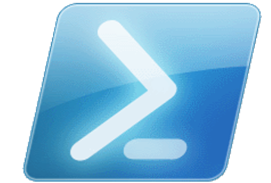

class: center, middle

# Module 1

---

# Agenda

1. Introduction
2. Deep-dive lskfjl
3. blah 

---

# Introduction

---

# Code slide

```
# blah
$commands = get-command
foreach ($command in $commands) {
    $command
}
$commands |select-object blah
```

---

# Images

.right[]

--

    blah
